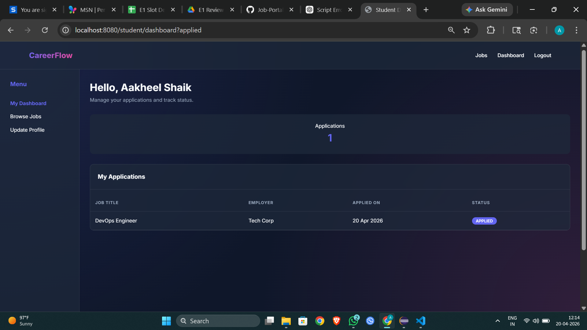
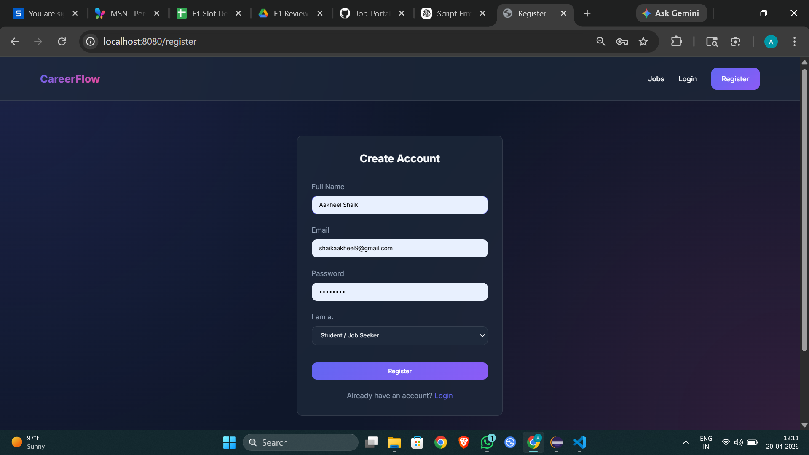
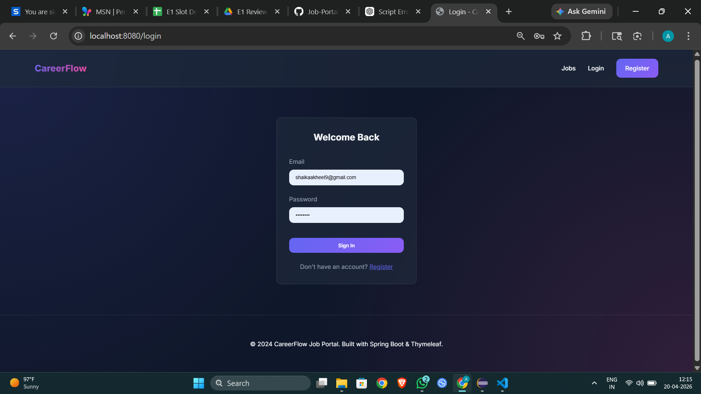
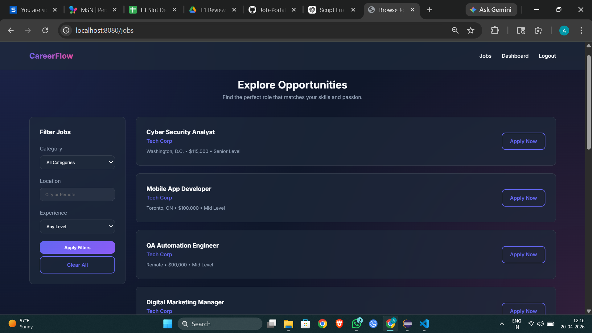

# Job Portal Management System

A full-stack **Job Portal Management System** built using **Spring Boot** that allows students to apply for jobs and recruiters to manage job postings efficiently.

---

##  Features

### Student

* Register & login
* View available jobs
* Apply for jobs
* Upload resume
* Track application status

###  Recruiter

* Post new jobs
* View applicants
* Update application status


---

## 🛠️ Tech Stack

* **Backend:** Spring Boot (Java)
* **Database:** MySQL
* **Build Tool:** Maven
* **Version Control:** Git & GitHub

---

## 📂 Project Structure

```
Job-Portal-Management-System/
│
├── src/
│   ├── main/
│   │   ├── java/com/jobportal/
│   │   │   ├── controller/
│   │   │   ├── service/
│   │   │   ├── repository/
│   │   │   ├── entity/
│   │   │   └── dto/
│   │   └── resources/
│   │       ├── application.properties
│   │
├── .gitignore
├── pom.xml
└── README.md
```

---

## ⚙️ Setup & Installation

### 1. Clone the repository

```bash
git clone https://github.com/aakheel007/Job-Portal-Management-System.git
cd Job-Portal-Management-System
```

### 2. Configure Database

Update `application.properties`:

```properties
spring.datasource.url=jdbc:mysql://localhost:3306/job_portal
spring.datasource.username=root
spring.datasource.password=
```

### 3. Run the project

```bash
mvn spring-boot:run
```

---

## 📡 API Endpoints (Sample)

| Method | Endpoint   | Description      |
| ------ | ---------- | ---------------- |
| GET    | /jobs      | Get all jobs     |
| POST   | /jobs      | Create job       |
| GET    | /user/{id} | Get user details |
| POST   | /apply     | Apply for a job  |

---

## 📸 Screenshots
### Dashboard


### Registeration Page


### Login Page


### Job Explore Page


---

## ⚠️ Important Notes

* `target/` folder is ignored (build files)
* `.env` and sensitive data should not be pushed

---

## 📌 Future Improvements

* JWT Authentication
* Role-based access (Admin/Student/Recruiter)
* Frontend integration (React/Angular)
* Resume parsing using AI

---

## 👨‍💻 Author

**Aakheel Shaik**

---

## ⭐ Contribute

Feel free to fork this repository and improve it!

---
